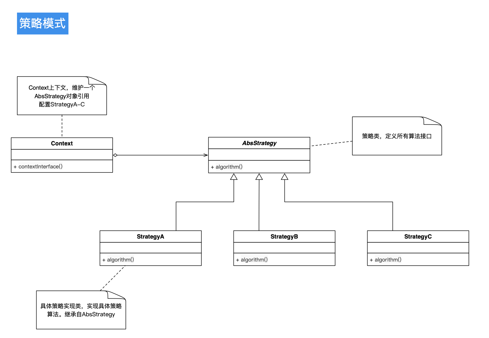

#### 策略模式

> 策略模式是一种定义一系列算法的方法，从概念上来看，
所有这些算法完成的都是相同的工作，只是实现不同，它可以以相同的方式调用所有的算法，
减少了各种算法类与使用算法类之间的耦合。

> 策略模式，封装了变化。 比如新增一个算法，对其余的算法没有任何影响。
只需要变更Context类或者客户端代码即可

> 优势点是：简化了单元测试，因为每个策略算法都是独立的类，
可以通过自己的接口去完成单元测试

> 不足之处：基础的策略模式，选择具体的算法策略实现是在客户端中去做，之后转给Context对象的。
这对于客户端而言，没有消除掉客户端的选择判断压力。 

> 策略模式，理论上是用来封装算法的，实际使用中，
也可以用来封装各种的规则。 比如常见的运营活动策略，
可以通过策略模式来封装规则。

备注：整理自大话设计模式 at 2020.03.31 